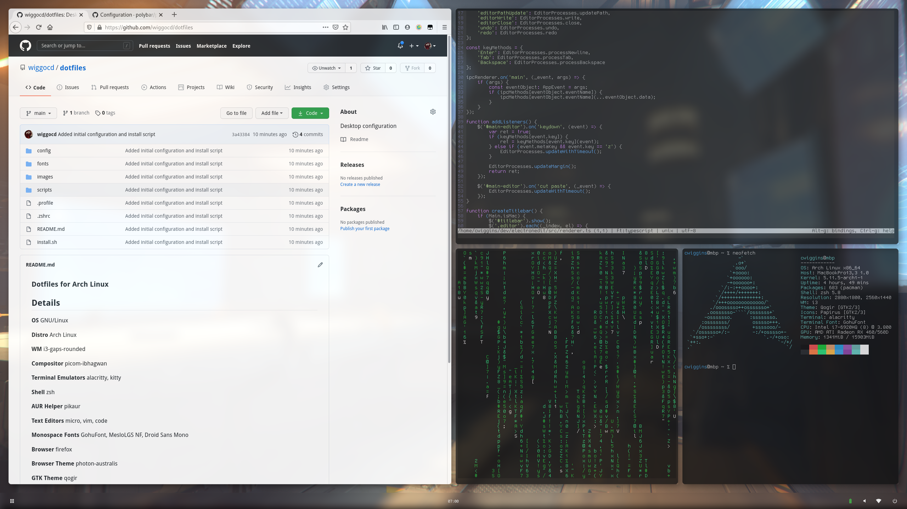
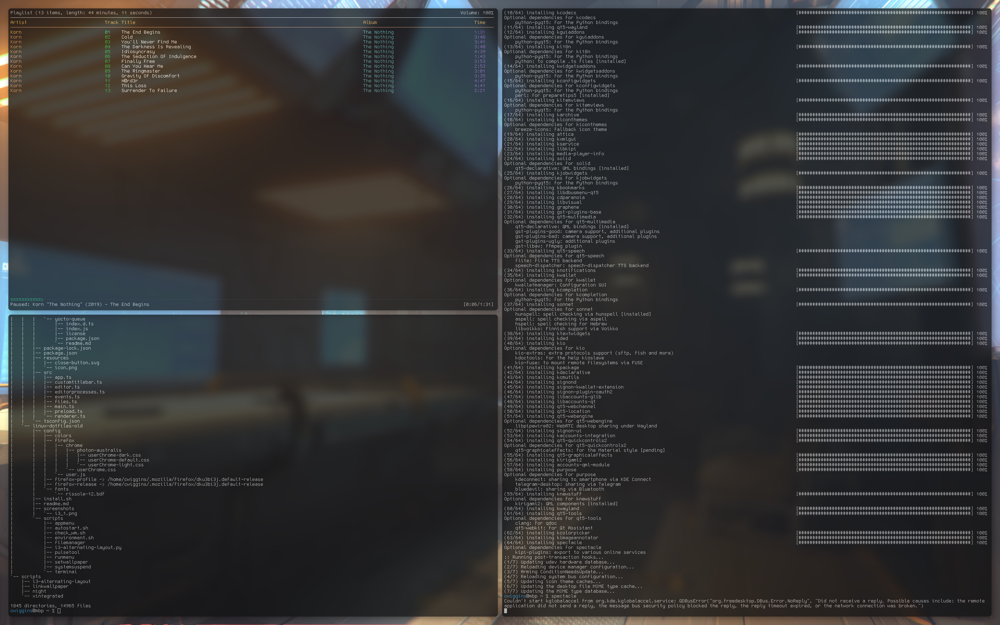

### Dotfiles for Arch Linux

## Screenshots

## Details

**OS** GNU/Linux

**Distro** Arch Linux

**WM** i3-gaps

**Compositor** picom-ibhagwan

**Bar** polybar, original theme by adi1090x (modified)

**Launcher** rofi

**Terminal Emulators** alacritty, kitty

**Shell** zsh

**Shell Theme** grml-zsh-config, powerlevel10k

**AUR Helper** pikaur

**Text Editors** micro, vim, code

**Monospace Fonts** GohuFont, MesloLGS NF, Droid Sans Mono

**UI Fonts** Droid Sans 11pt

**Browser** firefox

**Browser Theme** MaterialFox

**GTK Theme** ChromeOS-light-compact

**Icon Theme** Papirus

**Cursor Theme** McMojave Cursors

**Music Player** mpd + ncmpcpp

## Installation

**Dependencies (pacman/AUR, separated by spaces)** `zsh i3-gaps picom-ibhagwan-git polybar-git rofi feh autotiling`

**Optional** `alacritty kitty grml-zsh-config ttf-droid code firefox pikaur micro vim mpd mpc ncmpcpp zsh-theme-powerlevel10k-git redshift xorg-xset xss-lock`

**Other tools and packages used** `lxappearance lxpolkit libinput-gestures xorg-xrandr pulseaudio network-manager`

If you accept that configs will be overwritten, run `install.sh` to install the configuration files.
